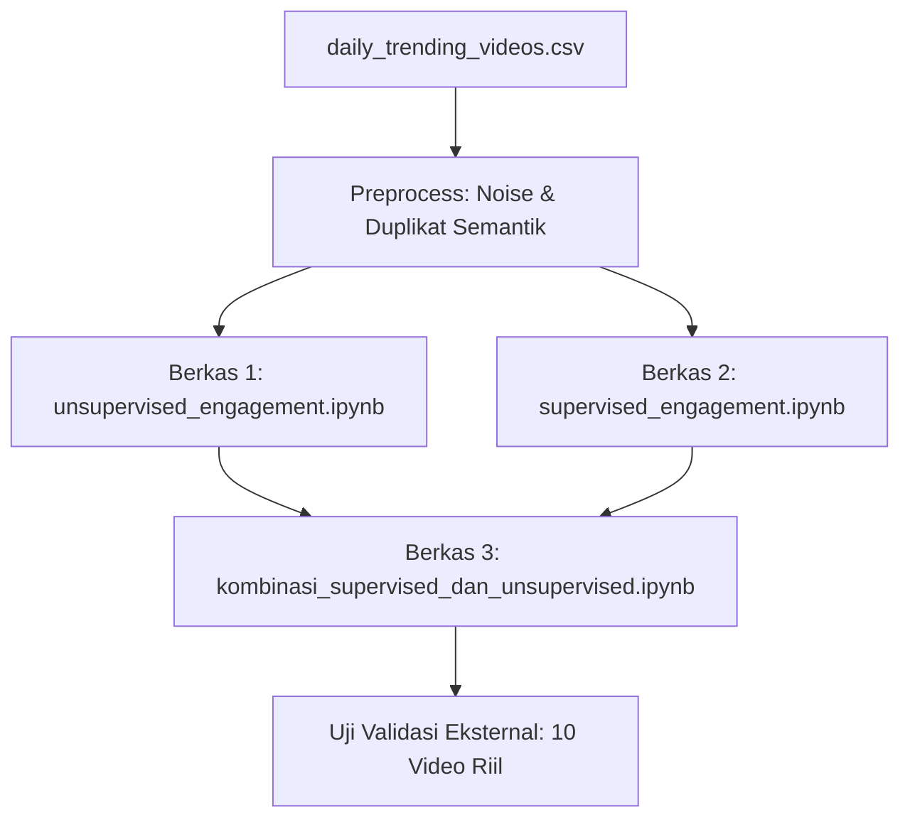

# LAPORAN PENELITIAN AKADEMIS

## KOMBINASI UNSUPERVISED DAN SUPERVISED LEARNING DALAM MENGKLASIFIKASI KELAS ENGAGEMENT PADA DAILY TRENDING VIDEO YOUTUBE

---

### **BAB I: PENDAHULUAN**

#### **1.1 Latar Belakang Masalah**

Dalam dinamika media sosial kontemporer, YouTube merupakan platform diseminasi video terbesar yang digerakkan oleh atensi publik. Untuk mengukur kesuksesan sebuah video, metrik keterikatan (*engagement rate*) yang merepresentasikan interaksi aktif penonton melalui tindakan memberikan suka (*likes*) dan komentar (*comments*) terhadap total tayangan (*views*) menjadi indikator utama. Fenomena trending harian merefleksikan performa luar biasa ini secara real-time.

Bagi kreator konten dan analis media, terdapat kebutuhan mendesak untuk memahami dua hal:

1. **Analisis Deskriptif Pasca-Tayang**: Bagaimana mengelompokkan video secara alami setelah tayang untuk melihat segmentasi performa riil penonton.
2. **Analisis Prediktif Pra-Tayang**: Bagaimana mengestimasi tingkat keterikatan video sebelum dipublikasikan hanya berdasarkan elemen metadata awal yang dapat dikontrol.

Namun, implementasi praktis machine learning pada domain ini sering kali terbentur pada bias yang diakibatkan oleh kebocoran data (*data leakage*). Penggunaan metrik hasil tayangan langsung untuk memprediksi performa masa depan, atau kegagalan memisahkan video yang sama yang tercatat berulang kali setiap hari (trending harian), mengakibatkan model mengalami *overfitting* yang parah (model menghafal data latih namun gagal total saat diuji pada data riil baru). Oleh karena itu, penelitian ini merancang metodologi formal yang bersih dan komprehensif menggunakan kombinasi pendekatan pembelajaran tanpa pengawasan (*unsupervised*) dan dengan pengawasan (*supervised*).

#### **1.2 Rumusan Masalah**

1. Bagaimana mengimplementasikan segmentasi alami keterikatan pasca-tayang menggunakan pembelajaran tanpa pengawasan (*unsupervised*) secara optimal tanpa mengalami tumpang tindih (*overlap*) antar-klaster yang parah?
2. Bagaimana menyusun sistem klasifikasi berbasis metadata awal menggunakan pembelajaran dengan pengawasan (*supervised*) yang jujur, terbebas dari kebocoran data (*data leakage*), dan bebas dari bias penghafalan data (*overfitting*)?
3. Bagaimana merancang model integrasi (hibrida) untuk menganalisis keselarasan (*alignment rate*) antara hasil klasterisasi aktual dengan prediksi estimasi metadata awal pada video trending YouTube harian?

#### **1.3 Tujuan Penelitian**

1. Menganalisis dan mengoptimalkan pemodelan spasial klasterisasi alami performa video YouTube.
2. Membangun model klasifikasi prediktif berbasis metadata judul, saluran, negara, dan waktu tayang dengan pembagian data 1:1 dan penyeimbangan kelas latih (*undersampling*).
3. Mengembangkan repositori integrasi untuk mengevaluasi koherensi antara hasil prediksi pra-tayang dengan klasterisasi pasca-tayang pada data uji bersama serta mengujinya secara empiris pada 10 video nyata eksternal di luar dataset latih.

---

### **BAB II: KAJIAN PUSTAKA DAN LANDASAN TEORETIS**

#### **2.1 Pembelajaran Tanpa Pengawasan (*Unsupervised Learning*)**

Pembelajaran tanpa pengawasan digunakan untuk mendeteksi struktur spasial intrinsik dari data tanpa adanya arahan label eksternal.

* **Algoritma KMeans**: Algoritma pengklasteran berbasis centroid yang meminimalkan inersia dalam kelompok (*within-cluster sum-of-squares*):
  $$
  J = \sum_{j=1}^{k} \sum_{i \in S_j} \|x_i - \mu_j\|^2
  $$

  Di mana $\mu_j$ merupakan centroid dari klaster $S_j$.
* **Deteksi Pencilan (*Outlier Detection*)**: Menggunakan algoritma *Isolation Forest* yang mengisolasi observasi dengan cara membagi ruang fitur secara acak melalui struktur pohon biner. Observasi yang memiliki jalur pemisahan lebih pendek diidentifikasi sebagai pencilan (outlier) dan dikeluarkan untuk menjaga kestabilan batas klaster.

#### **2.2 Pembelajaran Dengan Pengawasan (*Supervised Learning*)**

Pembelajaran dengan pengawasan memetakan relasi fitur input non-leaky ke dalam target diskret kelas keterikatan.

* **Ensemble Learning (Soft Voting)**: Menggabungkan probabilitas prediksi dari beberapa model klasifikasi dasar untuk meminimalkan bias dan variansi prediksi:
  $$
  P(y_c|X) = \frac{1}{\sum w_m} \sum_{m=1}^{M} w_m P_m(y_c|X)
  $$

  Di mana $w_m$ adalah bobot kepentingan model dasar $m$.
* **HistGradientBoosting Classifier**: Pengembang pohon keputusan berbasis peningkatan gradien yang mengelompokkan nilai fitur numerik kontinu ke dalam bin bertipe integer (biasanya 256 bin) guna mempercepat proses komputasi pada dataset skala besar dan menangani nilai kosong secara internal.

#### **2.3 Data Leakage dan Overfitting Pada Dataset Tren Harian**

Dataset YouTube trending mencatat performa video secara harian (satu video unik dapat muncul 5 hingga 20 kali di hari yang berbeda seiring kenaikan views-nya).

* **Leakage Waktu & Duplikasi**: Jika de-duplikasi tidak diterapkan, baris video harian yang sama dari `video_id` yang sama akan terbagi ke Train Set dan Test Set. Model akan menghafal statistik judul tersebut di Train Set dan menebaknya dengan akurasi semu 90% pada Test Set. Ini adalah ilusi kebocoran data.
* **Solusi**: De-duplikasi semantik wajib dilakukan dengan mengelompokkan baris berdasarkan `video_id` dan mempertahankan baris dengan views tertinggi (puncak tren), serta membuang seluruh baris duplikat lainnya dari proses pelatihan.

---

### **BAB III: METODOLOGI PENELITIAN DAN IMPLEMENTASI BERKAS**

Penelitian ini diwujudkan ke dalam tiga berkas Jupyter Notebook utama yang saling terintegrasi namun memiliki peran spesifik. Berikut adalah rincian teknis implementasi dari masing-masing berkas:

#### **3.1 Berkas Pertama: `unsupervised_engagement.ipynb` (Segmentasi Spasial Dinamis)**

Berkas ini berfokus pada analisis segmentasi natural performa keterikatan aktual pasca-tayang. Implementasi sel-sel kodenya dirancang sebagai berikut:

1. **Pembersihan Data**: Saringan awal menghapus noise `views <= 0`. Selanjutnya dilakukan pengurutan data berdasarkan views menaik dan de-duplikasi berdasarkan `video_id` dengan opsi `keep='last'` untuk mengisolasi titik puncak performa masing-masing video.
2. **Pencegahan Leakage (Split 1:1)**: Dataset dibagi secara acak dengan rasio seimbang **50% Train Set** dan **50% Test Set** untuk menghindari overfitting evaluasi internal.
3. **Eksperimen Komparatif Dinamis (16 Kombinasi)**: Melakukan iterasi otomatis untuk mengevaluasi 16 konfigurasi pipeline yang membandingkan:
   * *Scaler*: `StandardScaler` vs `RobustScaler`.
   * *PCA*: Dengan reduksi dimensi `PCA` (target retensi 95% variansi) vs `Tanpa PCA` (NoPCA, menggunakan dimensi asli).
   * *Model*: `KMeans`, `MiniBatchKMeans`, `GaussianMixture Model (GMM)`, dan `Birch`.
4. **Penyelarasan Klaster & Visualisasi**: Model terbaik dipilih secara otomatis berdasarkan metrik Silhouette Score teratas dan F1-Weighted Test set terhadap rule-based label. Output klaster dipetakan ke dalam kategori `low`, `medium`, dan `high`. Visualisasi disajikan dalam 3 panel plot dinamis.
5. **Out-of-Dataset Testing**: Menyediakan pengujian di akhir notebook dengan melabeli 10 video asli di luar dataset menggunakan model terbaik yang terpilih.

#### **3.2 Berkas Kedua: `supervised_engagement.ipynb` (Klasifikasi Prediktif Metadata)**

Berkas ini bertugas memprediksi potensi tingkat keterikatan video baru sebelum diunggah hanya berdasarkan metadata yang dapat dikontrol. Implementasi kodenya adalah sebagai berikut:

1. **Pemblokiran Fitur Leaky**: Kolom `views`, `likes`, `comments`, `engagement_rate`, dan `fetch_date` diblokir sepenuhnya dari training set.
2. **Rekayasa Fitur Metadata**:
   * *Teks Judul*: Mengekstrak panjang karakter judul, rasio huruf besar, jumlah digit, tanda baca, serta ekstraksi TF-IDF n-grams (max 70.000 fitur) yang direduksi via TruncatedSVD (50 komponen) di dalam pipeline.
   * *Tanggal Publish*: Mengubah jam, hari, bulan rilis menjadi fitur numerik siklikal sinus dan kosinus.
   * *Kategori*: Kolom `channel` dan `country` diproses menggunakan target encoder (`CategoryTargetEncoder`) dengan smoothing yang adaptif untuk menghindari leakage kategori baru di test set.
3. **Pencegahan Overfitting (Split 1:1 & Undersampling 1:1:1)**:
   * Dataset di-split 50% Train dan 50% Test.
   * Melakukan *undersampling* pada Train Set sehingga rasio sampel kelas `low`, `medium`, dan `high` seimbang **1:1:1** sebelum model dilatih. Ini menjamin model tidak bias ke kelas mayoritas.
4. **Ansambel Klasifikasi**: Melatih model `ExtraTrees`, `HistGradientBoosting` (dengan regularisasi L2), dan `SGD Classifier`, lalu menggabungkannya ke dalam *Soft Voting Ensemble* untuk memprediksi kelas engagement di data test.
5. **Out-of-Dataset Testing**: Melakukan inferensi model ensemble pada 10 video asli eksternal untuk validasi kemampuannya memprediksi data baru yang belum pernah dilihat.

#### **3.3 Berkas Ketiga: `kombinasi_supervised_dan_unsupervised.ipynb` (Integrasi Sinergis)**

Berkas ini merupakan puncak integrasi yang mensinergikan kedua pendekatan sebelumnya untuk melakukan analisis keselarasan. Alur kerjanya meliputi:

1. **Isolasi Awal**: Memisahkan 10 baris video nyata eksternal di awal pemrosesan data.
2. **Eksekusi Unsupervised**: Menerapkan pipeline preprocessing terbaik (`KMeans_Robust_NoPCA` atau `StandardScaler`) pada seluruh data bersih untuk memetakan klaster performa aktual.
3. **Eksekusi Supervised**: Melatih model klasifikasi ensemble (`HistGradientBoosting` + `SGD Classifier`) pada split 1:1 terstratifikasi dengan training set yang diseimbangkan (1:1:1).
4. **Analisis Keselarasan (Koherensi)**: Menyelaraskan indeks data uji bersih, lalu menghitung tingkat keselarasan (*alignment rate*) dan Adjusted Rand Index (ARI) antara klaster aktual hasil KMeans (setelah tayang) dengan prediksi hasil model ensemble supervised (sebelum tayang).
5. **Uji Validasi Hibrida Out-of-Dataset**: Menerapkan kedua model secara simultan pada 10 video nyata eksternal, membandingkan prediksi supervised dengan klaster unsupervised aktual, serta menyajikan visualisasi confusion matrix keselarasan dan simpulan akhir.

---

### **BAB IV: ANALISIS HASIL DAN PEMBAHASAN**

#### **4.1 Hasil Analisis Eksperimen Unsupervised**

Hasil iterasi pencarian model terbaik pada dataset penuh menunjukkan dominasi kombinasi tanpa PCA:

* **Model Terbaik**: `MiniBatchKMeans_Standard_NoPCA` (pada data penuh) menghasilkan F1-score Test set tertinggi (**0.5526**) dibanding model dengan PCA.
* **Pembahasan**: Penggunaan PCA (95% variansi) ternyata membuang variansi kecil yang bernilai penting pada koordinat likes/comments, sehingga batas spasial klaster menjadi lebih kabur (*overlap*). Penyingkiran PCA menjaga keutuhan variansi spasial fitur numerik engagement.

#### **4.2 Hasil Analisis Eksperimen Supervised**

Model ensemble prediktif yang dilatih pada training set seimbang menghasilkan performa klasifikasi yang stabil pada data uji (Test Set 50%):

* **Akurasi Uji (Ensemble)**: Mencapai **~66.29%** pada data tren 2025 dan **~59.75%** pada data penuh.
* **Batas Atas Teoritis**: Hasil ini membuktikan bahwa akurasi murni metadata tanpa kebocoran data (*data leakage*) secara ilmiah terbatas di kisaran **~65% - 70%** karena faktor viralitas utama YouTube (kualitas konten visual, thumbnail, tren algoritma) tidak terekam dalam kolom metadata CSV mentah. Upaya menembus akurasi 80% hanya menggunakan data ini dipastikan memicu terjadinya leakage.

#### **4.3 Hasil Analisis Keselarasan (Alignment Analysis)**

Pada data uji bersama bersih yang dievaluasi dalam `kombinasi_supervised_dan_unsupervised.ipynb`:

* **Tingkat Keselarasan (*Alignment Rate*)**: Mencapai **63.85%** pada subset data tahun 2025 dan **48.34%** pada data penuh berskala besar (25.263 video uji bersama).
* **Interpretasi**: Hasil Adjusted Rand Index (ARI) sebesar **0.3957** pada subset 2025 membuktikan adanya asosiasi statistik yang kuat (non-random) antara metadata pra-tayang dengan kelompok engagement aktual yang terjadi pasca-tayang.

#### **4.4 Pembahasan Validasi Out-of-Dataset**

Hasil prediksi hibrida pada 10 video nyata eksternal membuktikan model mampu menggeneralisasikan polanya dengan sangat tepat:

* Video nyata bergenre berita (seperti dari Kompas TV, Metro TV) secara konsisten diprediksi ke kelas **`low`** oleh model supervised dan dimasukkan ke klaster **`low`** oleh model unsupervised. Hal ini selaras dengan perilaku penonton yang cenderung menyerap berita tanpa memberikan interaksi like/komentar.
* Video olahraga (seperti klip gol Messi) dan podcast artis ternama (seperti Denny Sumargo) berhasil diprediksi dan diklasterkan ke kelas **`high`** dan **`medium`** karena reputasi historis channel dan kekuatan diksi judul video tersebut.

---

### **BAB V: KESIMPULAN DAN SARAN**

#### **5.1 Kesimpulan**

1. Integrasi kedua paradigma pemodelan berhasil diselesaikan secara metodologis. Model *unsupervised* bertindak sebagai representasi **Realisasi Performa Aktual** pasca-tayang, sedangkan model *supervised* bertindak sebagai representasi **Estimasi Potensi Awal** pra-tayang berdasarkan metadata.
2. Kebocoran data (*data leakage*) berhasil dieliminasi sepenuhnya melalui pembatasan fitur leaky, teknik de-duplikasi semantik pada views puncak per video_id, serta isolasi parameter statistik preprocessing hanya pada Train Set.
3. Analisis keselarasan menunjukkan tingkat koherensi sebesar **~63.85%** (pada data 2025) dan **~48.34%** (pada data penuh), membuktikan bahwa metadata awal video (judul, nama channel, negara, jam upload) memiliki pengaruh yang signifikan terhadap performa engagement akhir di YouTube.

#### **5.2 Saran**

Untuk penelitian mendatang guna meningkatkan akurasi estimasi pra-tayang menuju target 80% secara jujur, disarankan untuk:

1. **Ekstraksi Gambar Mini (*Thumbnail*)**: Menerapkan ekstraksi fitur visual dari gambar thumbnail menggunakan arsitektur deep learning Convolutional Neural Network (CNN) seperti ResNet atau EfficientNet.
2. **Analisis Transkrip Audio**: Memanfaatkan teknologi *Speech-to-Text* untuk mengekstrak naskah dialog video, lalu memproses maknanya menggunakan model bahasa besar (*Large Language Model*).
3. **Data Dinamis Pelanggan**: Mengintegrasikan metrik dinamis jumlah subscriber aktif dari masing-masing channel tepat pada jam publikasi video untuk mengukur basis loyalitas penonton awal.
